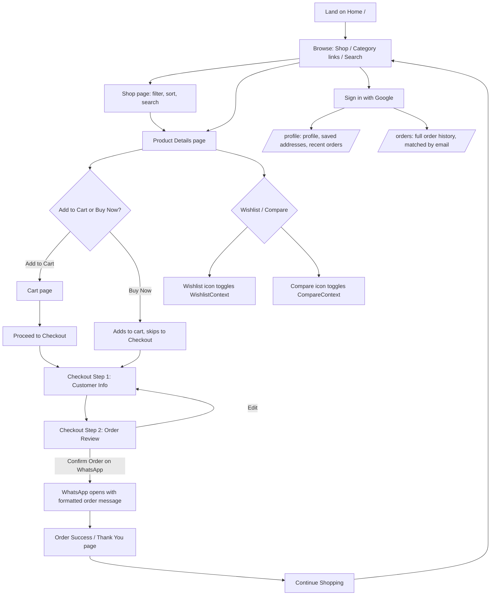
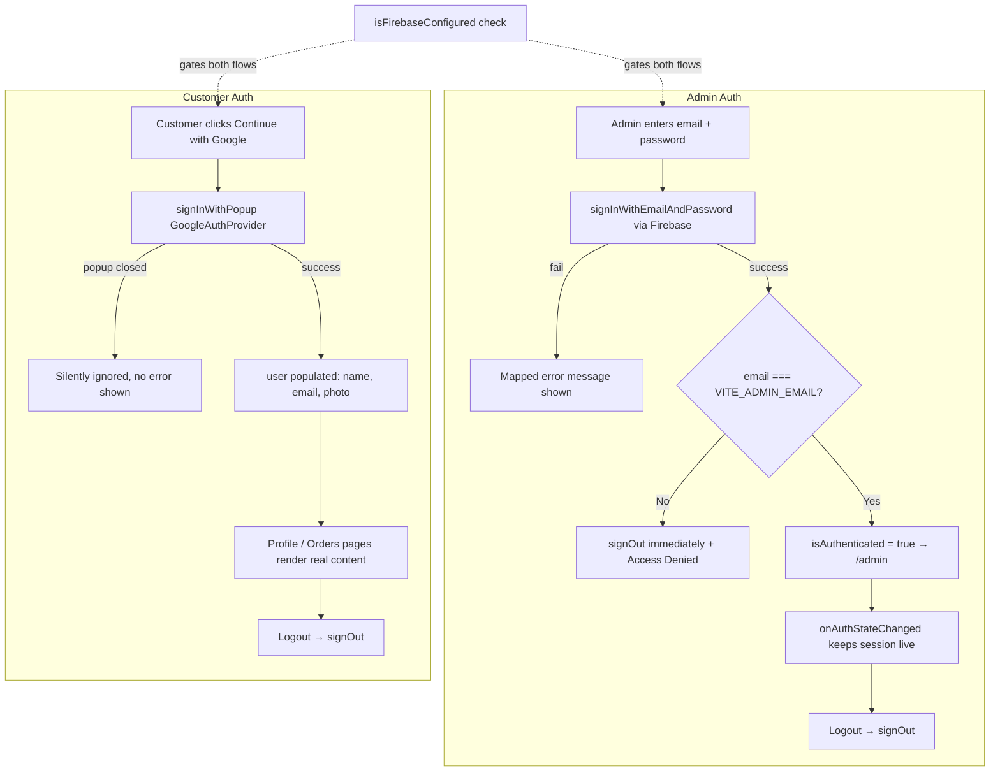
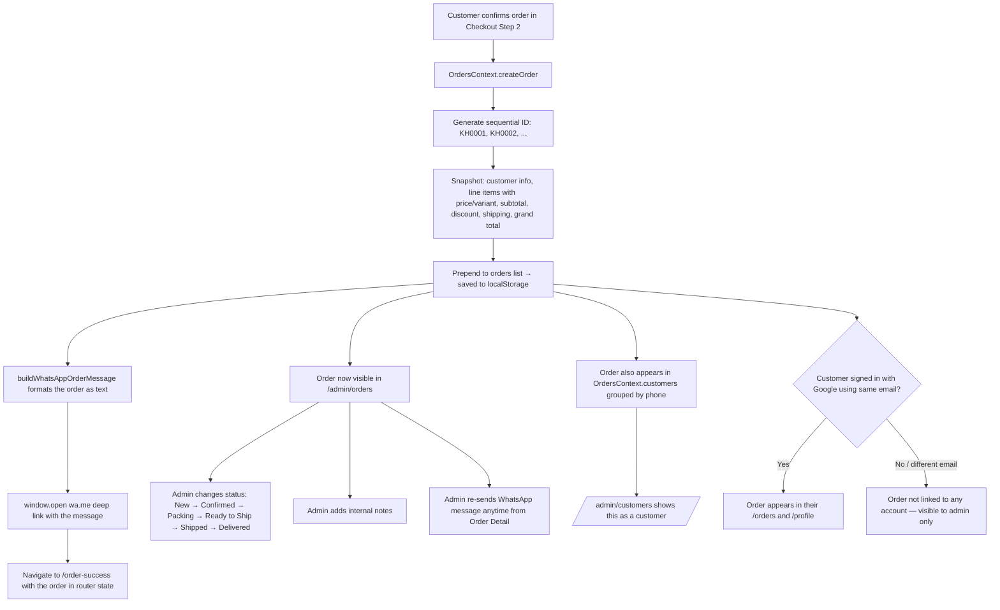

# 15 — Flowcharts

Diagrams use Mermaid syntax (renders natively in GitHub, VS Code with a Mermaid extension, and most modern markdown viewers).

## Customer Flow



## Admin Flow

```mermaid
flowchart TD
    A[Visit /admin] --> B{Signed in as admin?}
    B -->|No| C[/admin/login]
    C --> D[Enter email + password]
    D --> E{Firebase verifies}
    E -->|Wrong credentials| C
    E -->|Correct, but not the admin email| F[Signed out immediately + error shown]
    E -->|Correct + is admin email| G[/admin Dashboard]
    B -->|Yes| G

    G --> H[Products: list, add, edit, hide, publish, duplicate, delete, bulk actions]
    G --> I[Categories: CRUD + visibility]
    G --> J[Collections: CRUD + visibility]
    G --> K[Orders: list, filter by status]
    K --> L[Order Detail: change status, add internal note, message customer on WhatsApp, print]
    G --> M[Customers: derived from orders, view detail, export CSV]
    G --> N[Settings: store info, WhatsApp number, socials, change admin password]

    H --> O[Changes saved to ProductsContext / localStorage]
    O --> P[Instantly visible on live storefront]
```

## Authentication Flow



## Order Flow



## Product Flow

```mermaid
flowchart TD
    A[App first loads in a browser] --> B{localStorage has khayaal_products_v1?}
    B -->|No, fresh browser| C[Seed from data/productSeed.js — 54 demo products]
    B -->|Yes| D[Load existing products from localStorage]
    C --> E[ProductsContext holds the live product list]
    D --> E

    E --> F[Storefront reads: products filtered to isPublished only]
    F --> G[Home page: bestSellers / newArrivals]
    F --> H[Shop page: full catalogue + filters]
    F --> I[Product Details: getBySlug, getRelatedProducts, getCompleteTheLook]

    E --> J[Admin reads: allProducts, including hidden/unpublished]
    J --> K[/admin/products list]
    K --> L{Admin action}
    L -->|Add| M[addProduct → new record, id generated]
    L -->|Edit| N[updateProduct → patches record]
    L -->|Delete| O[deleteProduct / bulk deleteProducts]
    L -->|Duplicate| P[duplicateProduct → copy, unpublished by default]
    L -->|Toggle publish/hide| Q[bulkUpdate isPublished]
    M --> R[Write back to localStorage]
    N --> R
    O --> R
    P --> R
    Q --> R
    R --> E
```
